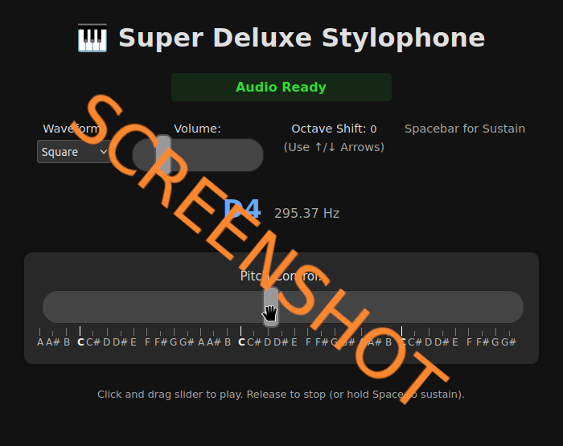

# js_stylophone

## Play it now: https://pemmyz.github.io/js_stylophone/

## Screenshots

# 🎹 Super Deluxe Stylophone

A sleek, modern, browser-based stylophone synthesizer powered by the Web Audio API.

Play and experiment with different waveforms, octave shifts, sustain mode, and live pitch control using a stylish slider interface. Great for quick musical sketches, learning synthesis, or just making cool sounds!

---

## 🎧 Features

- 🎛️ **Waveform Selection** – Sine, Square, Sawtooth, Triangle, PWM, FM, AM, Ring Mod
- 🔊 **Volume Control**
- 🔼🔽 **Octave Shift** via Arrow Keys
- ⌨️ **Sustain Pedal Mode** (Spacebar)
- 🎼 **Pitch Control Slider** with Real-time Note/Frequency Display
- 🌓 **Dark & Light Mode** Toggle
- 🧠 **Intelligent Audio Initialization** with error feedback
- 🎹 **Note Marker Bar** aligned to pitch

---

## 🛠️ Built With

- **HTML5**
- **CSS3** (custom dark/light theme)
- **JavaScript** (Vanilla, no dependencies)
- **Web Audio API** – for sound synthesis

---

## 📸 Preview

<!-- Optional: Add actual interface preview -->
<!--  -->

---

## ⌨️ Keyboard Shortcuts

| Key       | Function             |
|-----------|----------------------|
| ↑ / ↓     | Octave up/down       |
| Spacebar  | Toggle sustain pedal |

---

## 📄 License

MIT License  
See [`LICENSE`](LICENSE) for details.

---

## 🙌 Acknowledgements

Inspired by the original Stylophone and web synth experiments.  
Built with ❤️ and the Web Audio API.

---

## 💡 Future Ideas

- Preset saving  
- Mobile touch optimizations  
- Reverb/delay effects  
- Polyphonic support

